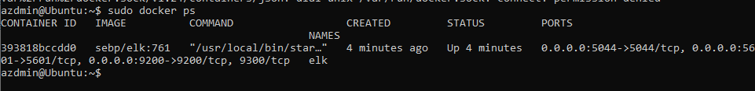

## Automated ELK Stack Deployment

The files in this repository were used to configure the network depicted below.

These files have been tested and used to generate a live ELK deployment on Azure. They can be used to either recreate the entire deployment pictured above. Alternatively, select portions of the playbook file may be used to install only certain pieces of it, such as Filebeat.

  - [Filebeat Playbook](Ansible/filebeat-playbook.yml)
  - [Metricbeat Playbook](Ansible/metricbeat-playbook.yml)
  - [DVWA Playbook](Ansible/dvwa-playbook.yml)

This document contains the following details:
- Description of the Topology
- Access Policies
- ELK Configuration
  - Beats in Use
  - Machines Being Monitored
- How to Use the Ansible Build

### Description of the Topology

The main purpose of this network is to expose a load-balanced and monitored instance of DVWA, the D*mn Vulnerable Web Application.

Load balancing ensures that the application will be highly available, in addition to restricting access to the network.
- The load balancer prevents any particular web server from being overwhelmed from too much incoming traffic.  The load balancer directs web traffic between the web servers. Additionally, if a web server goes down, the load balancer redirects traffic to an active server. The load balancer could protect against a DDOS attack. Meanwhile, the jump box provides a single point of administration.

Integrating an ELK server allows users to easily monitor the vulnerable VMs for changes to the log files and system resources
- Filebeat checks files. It monitors, collects, and forwards logs to Elasticsearch.
- Metricbeat collects and ships metrics to Elasticsearch.

The configuration details of each machine may be found below.

| Name     | Function            | IP Address | Operating System     |
|----------|---------------------|------------|----------------------|
| Jump Box | Gateway             | 10.0.0.4   | Linux (Ubuntu 18.04) |
| Web-1    | Web Server          | 10.0.0.7   | Linux (Ubuntu 18.04) |
| Web-2    | Web Server          | 10.0.0.6   | Linux (Ubuntu 18.04) |
| ELK      | ElasticSearch Stack | 10.1.0.4   | Linux (Ubuntu 18.04) |

### Access Policies

The machines on the internal network are not exposed to the public Internet.

Only the jumpbox machine can accept connections from the Internet. Access to this machine is only allowed from the following IP address:
- 97.89.28.211

Machines within the network can only be accessed by the jumpbox.
- Jumpbox
  - Public IP: 52.234.135.219
  - Private IP: 10.0.0.4

A summary of the access policies in place can be found in the table below.

| Name          | Publicly Accessible | Allowed IP Addresses |
|---------------|---------------------|----------------------|
| Jump Box      | Yes/No              | 97.89.28.211         |
| Web-1 & Web-2 | Yes                 | *                    |
| ELK           | Yes                 | 97.89.28.211         |

### Elk Configuration

Ansible was used to automate configuration of the ELK machine. No configuration was performed manually, which is advantageous because it gives the admin the ability to push updates to multiple systems simultaneously instead of one by one.

The playbook implements the following tasks:
- Installs Docker
- Installs Python and pip3
- Configures the target machine to use more memory
- Installs the Docker Python module
- Downloads and launches Docker container sebp/elk:761
- Configures the port mappings with which the container should start
- Enables Docker

The following screenshot displays the result of running `docker ps` after successfully configuring the ELK instance.

### Target Machines & Beats
This ELK server is configured to monitor the following machines:
- 10.0.0.7 (Web-1)
- 10.0.0.6 (Web-2)

We have installed the following Beats on these machines:
- We have installed Filebeat and Metricbeat on Web-1 and Web-2.

These Beats allow us to collect the following information from each machine:
- Filebeat collects logs.  It is able to show us the syslogs by server by time along with the process being run and the messages received.  Metricbeat provides metrics such as CPU usage, memory, the number of containers on a machine, and the status of containers.

### Using the Playbook
In order to use the playbook, you will need to have an Ansible control node already configured. Assuming you have such a control node provisioned:

SSH into the jump box and follow the steps below:
- Copy the install-elk.yml file to /etc/ansible/roles/install-elk.yml.
- Update the hosts file to include your destination IP of the elk server.
- Run the playbook, and navigate to http://40.77.1.194:5601/app/kibana to check that the installation worked as expected.

- Copy filebeat-playbook.yml and metricbeat-playbook.yml from /etc/ansible/roles.
- Update the hosts file under the appropriate server with the machine's internal IP address to make Ansible run the playbook on a specific machine.
- Navigate to the following URL to check that the ELK server is running: http://40.77.1.194:5601/app/kibana
